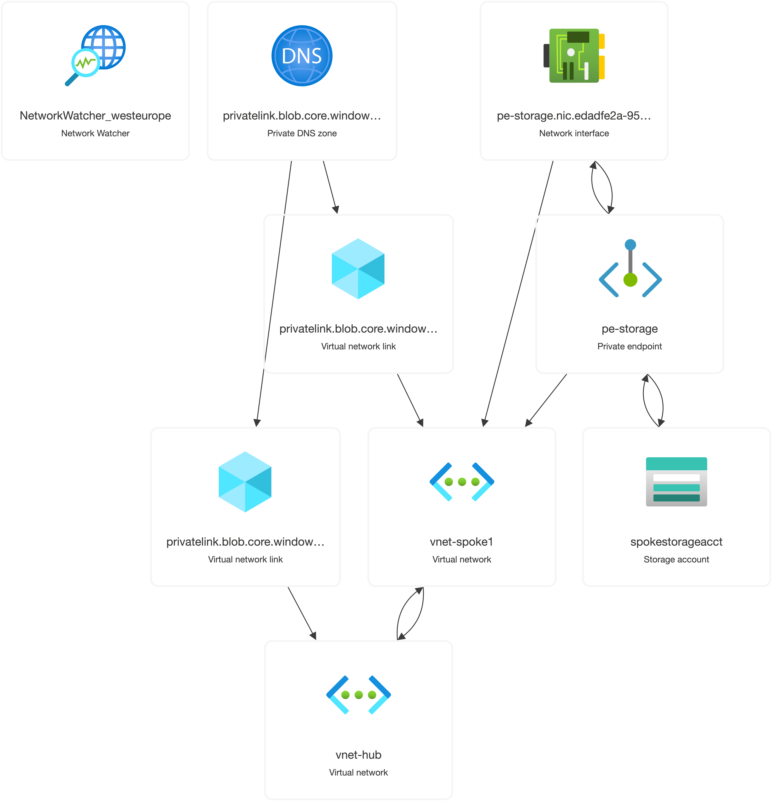

= PrivatelinkMesh
:toc: macro
:toc-title: Contents
:icons: font
:source-highlighter: rouge
:sectnums:
:sectnumlevels: 3

A reference implementation of a secure, scalable Hub-and-Spoke network topology in Azure using Terraform. This setup demonstrates private service access via Private Endpoints and centralized DNS resolution via Azure Private DNS Zones.

== 🧠 Overview

`azure-private-link-mesh` provisions the following resources:

- A **Hub VNet** hosting a centralized Private DNS Zone
- One or more **Spoke VNets**
- A **Storage Account** with a **Private Endpoint** in a Spoke
- **Private DNS Zone** linked to the Hub and Spokes
- **VNet Peering** between Hub and Spokes

This architecture allows spoke resources to resolve Azure service FQDNs via Private DNS, ensuring fully private communication.

== 📦 Structure

[plantuml, format="svg"]
----
@startuml
title PrivatelinkMesh Network Topology

actor Developer

cloud "Azure" {
  [Hub VNet] --> [Private DNS Zone]
  [Spoke VNet 1] --> [Private Endpoint]
  [Spoke VNet 1] --> [VNet Peering]
  [Hub VNet] --> [VNet Peering]
  [Private Endpoint] --> [Storage Account]
}

@enduml
----

== 🚀 Getting Started

=== Prerequisites

- Azure CLI authenticated (`az login`)
- Terraform >= 1.3
- Access to create Azure resources

=== Setup

Clone the repo and initialize Terraform:

[source,sh]
----
terraform init
terraform apply
----

== 🏗️ Resources Created

|===
| Resource | Name | Description

| Resource Group | `rg-hubspoke-demo` | Container for all resources
| VNet (Hub) | `vnet-hub` | Central network with DNS zone
| VNet (Spoke) | `vnet-spoke1` | Spoke network with Private Endpoint
| Storage Account | `spokestorageacct` | Target for Private Endpoint
| Private Endpoint | `pe-storage` | Private access to Storage
| Private DNS Zone | `privatelink.blob.core.windows.net` | Resolves service FQDNs to private IPs
| DNS Links | `hub-dns-link`, `spoke1-dns-link` | Connect DNS zone to both VNets
| VNet Peering | `hub-to-spoke1`, `spoke1-to-hub` | Enables traffic flow between VNets
|===

== 🛡️ Security

- All data access is via **Private IPs**.
- No public IPs are exposed for services.
- DNS resolution is internal and isolated per network.

== 📄 License

MIT License - see the LICENSE file for details.

